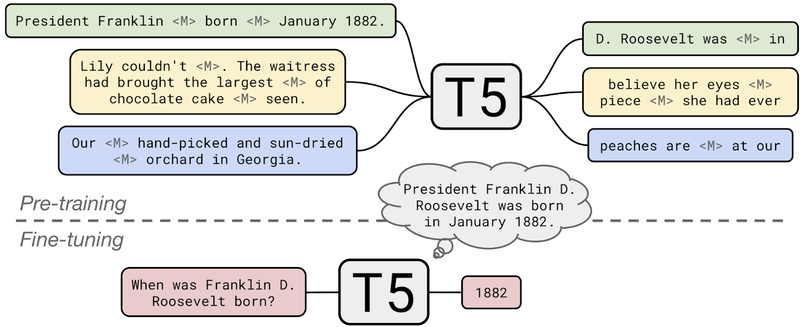
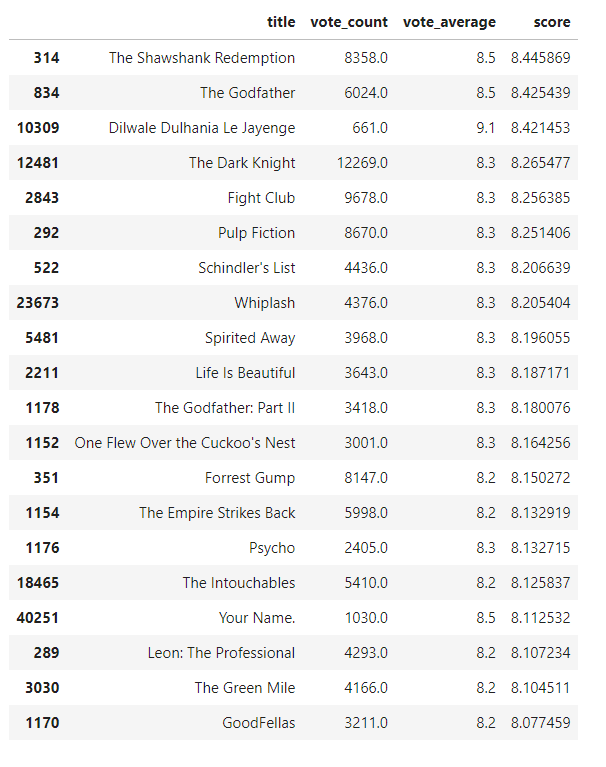
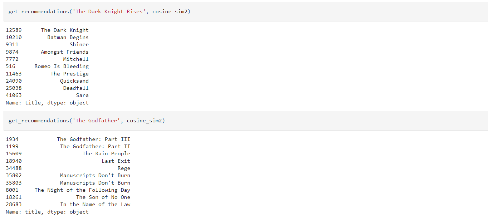
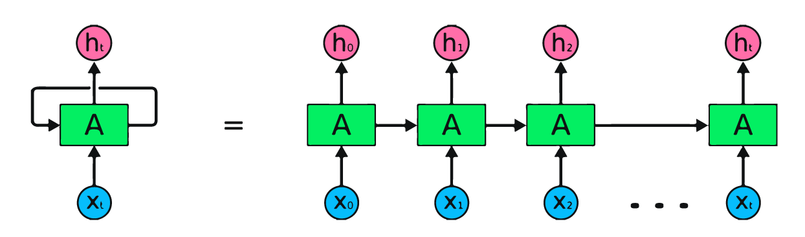
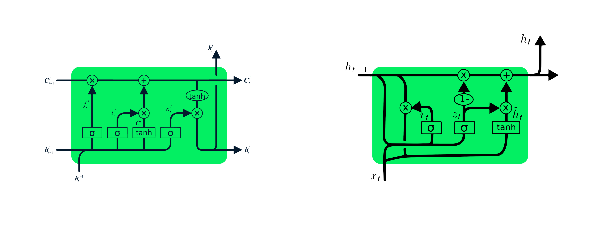

# Portfolio
---
## Natural Language Processing

### Summarization and translation from YouTube videos using mT5 multilanguage tranformers architecture.

**Summarization:** In this notebook I'll use the HuggingFace's transformers library to fine-tune a pretrained summarization module which summarize texts in Spanish using the fine-tuned multilanguage mT5 encoder/decorder architecture.
 

**Neural Machine Translation:** In this notebook I'll use the HuggingFace's transformers library to fine-tune a pretrained NMT module which translates texts from Spanish to English using the multilanguage mT5 encoder/decorder architechture.
 

**Flask End-to-End Deep learning APP:** Front-end and Back-end using the pretrained models and deployed with Flask 
([GitHub](https://github.com/chriskhanhtran/CS224n-NLP-Solutions/tree/master/assignments/)).

---

### Simple-Movie-Recommender from IMDB movies dataset

This project cover 2 approaches, the first simple recommender does the following: Decide on the metric or score to rate movies on. Calculate the score for every movie. Sort the movies based on the score and output the top results. The second approach build a system that recommends movies that are similar to a particular movie to finally create the recommendation based on the following metadata: the 3 top actors, the director, related genres, and the movie plot keywords. Compute pairwise cosine similarity scores for all movies based on their plot descriptions and recommend movies based on that similarity score threshold. Tokenized, vectorized text data using TF-IDF and cosine similarity to get a content based recommender and credits, genres, and keywords based recommender.

 

 

---
### Detect Spam Messages: TF-IDF and Naive Bayes Classifier

In order to predict whether a message is spam, first I vectorized text messages into a format that machine learning algorithms can understand using Bag-of-Word and TF-IDF. Then I trained a machine learning model to learn to discriminate between normal and spam messages. Finally, with the trained model, I classified unlabel messages into normal or spam.

 

 

---
## Data Science

### MasterCard stock price time series forecasting using LSTM and GRU

RNN remembers past inputs due to an internal memory which is useful for predicting stock prices, generating text, transcriptions, and machine translation. In this notebook I'll use LSTM and GRU that are an advanced type of RNN. RNN simple structure suffers from short memory, where it struggles to retain previous time step information in larger sequential data. These problems can easily be solved by long short term memory (LSTM) and gated recurrent unit (GRU), as they are capable of remembering long periods of information. In this notebook I will show you a preprocessed dataset from May-25-2006 to Oct-11-202 and how to built machine learning models to predict the stock price using both LSTM and GRU.

---

### Credit Risk Prediction Web App

After my team preprocessed a dataset of 10K credit applications and built machine learning models to predict credit default risk, I built an interactive user interface with Streamlit and hosted the web app on Heroku server.

 

 

---
### Kaggle Competition: Predict Ames House Price using Lasso, Ridge, XGBoost and LightGBM

I performed comprehensive EDA to understand important variables, handled missing values, outliers, performed feature engineering, and ensembled machine learning models to predict house prices. My best model had Mean Absolute Error (MAE) of 12293.919, ranking <b>95/15502</b>, approximately <b>top 0.6%</b> in the Kaggle leaderboard.

 

 

---
### Predict Breast Cancer with RF, PCA and SVM using Python

In this project I am going to perform comprehensive EDA on the breast cancer dataset, then transform the data using Principal Components Analysis (PCA) and use Support Vector Machine (SVM) model to predict whether a patient has breast cancer.

 

 

---
### Business Analytics Conference 2018: How is NYC's Government Using Money?

In three-month research and a two-day hackathon, I led a team of four students to discover insights from 6 million records of NYC and Boston government spending data sets and won runner-up prize for the best research poster out of 18 participating colleges.

 

 

---
## More about me...

Besides Data Science, I also have a great passion for soccer and music. I love to see great games and live concerts as well I try to play soccer very often and play guitar and piano.

 
---

© 2023 Andres Carvajal. Powered by Jekyll and the Minimal Theme.

