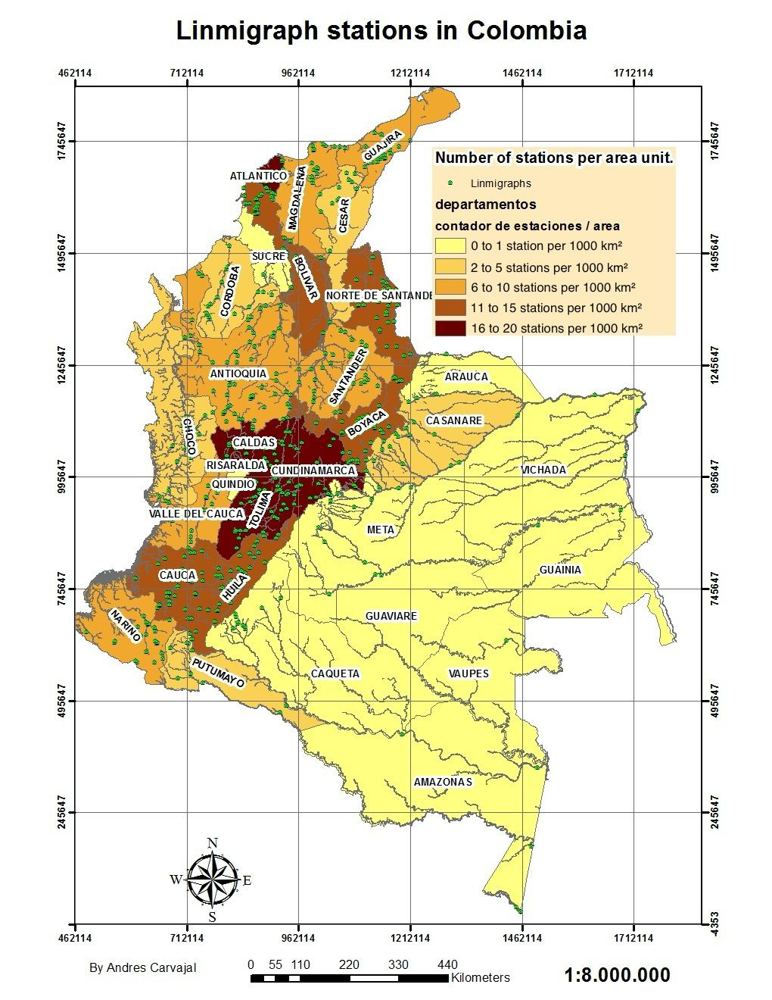
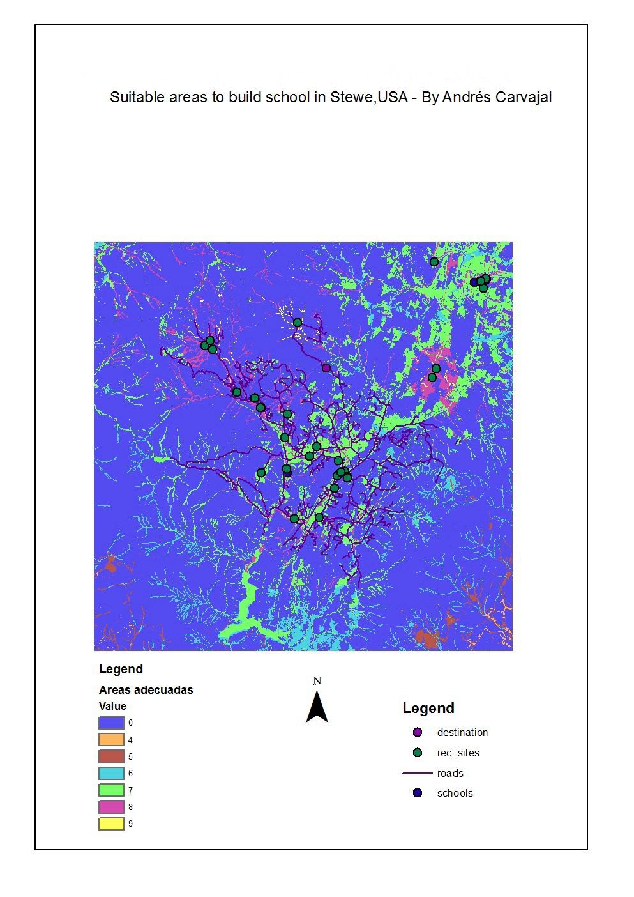

# Portfolio
---
## AI / Machine Learning
### Interior Design Generator - Vue.js & FastAPI
### Code: Comming Soon!

<div style="text-align: justify">
The Interior Design Generator streamlines the creative process with its innovative use of AI, transforming textual descriptions into precise and vivid interior designs. Featuring advanced technologies such as Stable Diffusion, ControlNet, and the Segment Anything model for inpainting, this platform allows for the meticulous editing and refinement of interiors. A notable feature includes a drawable box tool, empowering users to define areas for targeted modification through inpainting, seamlessly integrating or altering elements within a space. With two key functionalities—'Generate' for creating or modifying the overall design and 'Inpaint' for precise adjustments within selected areas—users have unparalleled control over the design process. Built on Vue.js for an engaging user experience and FastAPI for robust backend support, this tool caters to both seasoned designers and hobbyists eager to explore the fusion of technology and interior design. Embrace this modern approach to design visualization and customization.
</div>
<center></center>
<br>


---
## Natural Language Processing

### Summarization and translation from YouTube videos using mT5 multilanguage tranformers architecture.
<center></center>
[](https://github.com/andresca94/Summarization-and-translation-from-YouTube-videos-using-mT5-multilanguage-tranformers-architecture.)
<center></center>
**Summarization:**
<div style="text-align: justify">In this notebook I'll use the HuggingFace's transformers library to fine-tune a pretrained summarization module which summarize texts in Spanish using the fine-tuned multilanguage mT5 encoder/decorder architecture.</div>
<br>
[](https://colab.research.google.com/drive/11jG-rhploTYvfrE8P5cUd6LSOTKZcyNX#scrollTo=ZGXDBmcwcxQL)


**Neural Machine Translation:** 
<div style="text-align: justify">In this notebook I’ll use the HuggingFace’s transformers library to fine-tune a pretrained NMT module which translates texts from Spanish to English using the multilanguage mT5 encoder/decorder architechture.</div>
<br>
[](https://colab.research.google.com/drive/1RbtfwyhdZx8aTWruQMgmuVNXfN0UsQq6?authuser=1)

**Flask End-to-End Deep learning APP:** Front-end and Back-end using the pretrained models and deployed with Flask
<br>
[](https://colab.research.google.com/drive/1nTsgWxsjUmw2Xiq1PLEfHPY8ZQ0DzPw-?authuser=1#scrollTo=QramYSC3lpa7)


<center></center>

---
### Simple-Movie-Recommender and Content Based-Recommender from IMDB movies dataset

[](https://github.com/andresca94/Simple-Movie-Recommender)

<div style="text-align: justify">This project cover 2 approaches, the first simple recommender does the following: Decide on the metric or score to rate movies on. Calculate the score for every movie. Sort the movies based on the score and output the top results. The second approach build a system that recommends movies that are similar to a particular movie to finally create the recommendation based on the following metadata: the 3 top actors, the director, related genres, and the movie plot keywords. Compute pairwise cosine similarity scores for all movies based on their plot descriptions and recommend movies based on that similarity score threshold. Tokenized, vectorized text data using TF-IDF and cosine similarity to get a content based recommender and credits, genres, and keywords based recommender.</div>
<br>
<center></center>
<center></center>
<br>

---
## Databases

### Fuzzy Wuzzy Matching Project

[](https://github.com/andresca94/Fuzzy_wuzzy_matching)

<div style="text-align: justify">
The Fuzzy Wuzzy Matching Project harnesses the power of Python's FuzzyWuzzy library to link records from two distinct datasets, BASE A and BASE B, without the necessity for exact matches. This technique, rooted in the Levenshtein Distance, is pivotal for data reconciliation where discrepancies and inconsistencies across datasets are a common challenge. By employing fuzzy string matching, the project addresses the inherent variability in naming conventions, typographical errors, and incomplete data records to identify potential matches. Throughout this notebook, we detail the processes of importing, cleaning, standardizing, and transforming the data to facilitate the fuzzy matching process. The methodology adopted not only demonstrates the application of fuzzy matching at scale but also lays the groundwork for more advanced data integration tasks. The project's success is underscored by the identification of over 1,600 high-quality matches, signifying a substantial step forward in data consolidation efforts. The insights and techniques presented herein are invaluable for data scientists and analysts dealing with similar data matching challenges.
</div>

### Code Snippets
Here's an example of the data cleaning and transformation step:
```python
def limpiar_dataframe(df):
    for columna in df.columns:
        if df[columna].dtype == 'object':
            df[columna] = df[columna].astype(str).lower().strip()
            df[columna] = df[columna].astype("string")
    return df

base_a_cleaned = limpiar_dataframe(base_a.copy())
base_b_cleaned = limpiar_dataframe(base_b.copy())
```
<center></center>

Here's an example of effectively solves the problem of matching two databases.
```python
def enhanced_fuzzy_match(row):
    best_match = None
    best_score = 0
    
    for _, match_row in base_b_df.iterrows():
        score1 = fuzz.ratio(row['NombreEstablecimiento'], match_row['NombreEstablecimiento'])
        score2 = fuzz.ratio(row['Ciudad'], match_row['Ciudad'])
        score3 = fuzz.ratio(row['Direccion'], match_row['Direccion'])
        
        weighted_score = (score1 + score2 + score3) / 3.0  # Updated the average calculation

        if weighted_score > best_score:
            best_score = weighted_score
            best_match = match_row['ID']
            
    if best_score >= 85:
        return best_match  
    return None
```
This function effectively solves the problem of matching two databases.
```python
base_a_df['ID_from_base_b'] = base_a_df.progress_apply(enhanced_fuzzy_match, axis=1)
base_a_df.to_sql('base_a_with_matches', connection, if_exists='replace', index=False)
connection.close()
```
The enhanced fuzzy matching function is applied with a progress bar, and the DataFrame is saved back to a new SQL table. Finally, the database connection is closed to ensure that all changes are finalized.
<center></center>
---

## Data Science

### MasterCard stock price time series forecasting using LSTM and GRU

[](https://github.com/andresca94/MasterCard-Stock-Price-Prediction-Using-LSTM-and-GRU)

<div style="text-align: justify">RNN remembers past inputs due to an internal memory which is useful for predicting stock prices, generating text, transcriptions, and machine translation. In this notebook I'll use LSTM and GRU that are an advanced type of RNN. RNN simple structure suffers from short memory, where it struggles to retain previous time step information in larger sequential data. These problems can easily be solved by long short term memory (LSTM) and gated recurrent unit (GRU), as they are capable of remembering long periods of information. In this notebook I will show you a preprocessed dataset from May-25-2006 to Oct-11-2022 and how to built machine learning models to predict the stock price using both LSTM and GRU.The model consists of either a single hidden layer of LSTM or GRU and an output layer. LSTM units to 125, tanh as activation, the model will train on 50 epochs with 32 batch sizes. GRU model got 5.95 rmse on the test dataset, which is an improvement from the LSTM model with rmse of 6.47.</div>

<center></center>

<center></center>
---

### Multiclass prediction and clustering for music genre
<div style="text-align: justify">Data cleaning, handling entropy, feature engineering and data visualization. Encoding categorical data and preprocessing dataset. Trained XGboots, Random Forest and Logistic Regression, checking accuracy and confusion matrix to select the best model. Feature importance, ROC curve and SHAP values for explainability. Finding the appropriate K-values with elbow method, balancing the dataset after feature selection and evaluating K-means visually with PCA.</div>

**Classification:** 
<br>
[](https://github.com/andresca94/MulticlassPrediction-Music-Genre-Random-Forest-Logistic-Regression-XGBoots)

**Clustering:** 
<br>
[](https://github.com/andresca94/K-means-clustering-for-music-genre-prediction/blob/main/K-means-clustering%20for%20music%20genre%20prediction.ipynb)
<br>
<center></center>
<center></center>
<br>

## GIS
---
### Motor-Colission-App-Streamlit

[](https://github.com/andresca94/Motor-Colission-App-Streamlit)

<div style="text-align: justify">Loaded and cleaned the Motor Collision in New York City dataset. Creation of a 3D map and data visualization to respond the questions “Where are the most people injured in NYC?” and “How many collisions occur during a given time of day”. Breakdown by minute and affected type Pedrestrians, Cyclist, Motorist. Front end using Streamlit.</div>
<br>
<center></center>

<br>

### Cartographic Analysis of Linimgraph Stations in Colombia


<div style="text-align: justify">
The map presented corresponds to the territory of Colombia, the base map was obtained from the 1:1,000,000 base cartography of the Colombian Institute Agustin Codazzi. The station data was obtained from the Colombian Institute of Meteorology and Hydrology IDEAM, and these shapefiles were mounted on the base cartography. Then, a join table was made to join the attributes based on the department, after which a color map was created showing the number of stations normalized by area of the form. The unit of area used was per 1000 km². No meta data was used.
</div>

By specifying the unit of area as per 1000 km², it allows for a consistent and standardized measurement that can be easily compared and analyzed, making it a vital statistic for geographic and demographic studies.

<center></center>

<br>

### GIS Spatial Analysis for School Location in Stowe, Vermont

<div style="text-align: justify">
The city of Stowe, Vermont, USA, experienced a large increase in population. Demographic data suggest that this increase is due to families with children moving to the region and taking advantage of the large number of recreation facilities located nearby. It was decided to build a new school to ease the pressure on the existing schools and as a planner you were tasked with finding the potential site. The data used comes from ESRI, included in the Arcmap CD, contains data from (Elevation, Land Use, Roads, Rec_sites, Schools, Destination). 

A suitability map is created to help find the best location for a new school. By deriving distance and slope datasets, the datasets are reclassified to a common scale, then the ones that are most important to consider are weighed and combined to find the most suitable locations. Finally, the sweet spot is located with the ArcMap selection tools. The input datasets for this exercise are: landuse, elevation, rec_sites, and schools. 

Slopes, distance to recreation places and distance to existing schools are obtained, reclassifying these derived datasets on a common scale of 1 to 10; They are weighted together with the landuse dataset based on a percentage of influence and you will combine them to produce a map showing the appropriate locations for the new school. The optimal location for the new school among the alternatives is then defined based on the reclassified scale.
</div>
<br>
<center></center>

<br>

---
## STEM MSc Civil Engineering Thesis 
[http://hdl.handle.net/1992/52990](https://repositorio.uniandes.edu.co/bitstream/handle/1992/52990/25247.pdf?sequence=1)
<div style="text-align: justify">A program was developed in MATLAB to show the relationship between the probability of occurrence of landslide and the size of the landslide from slope statistics obtained from digital elevation models (DEM) with spatial resolution of (30x30m) of two zones with different geological and geomorphology origins. The program must consider all the possible neighbors or clusters of an elevation matrix as input using image processing tools, and as output the statistics of the related clusters, to conclude if the topography is organized in a fractal way or invariant with the scale and being a characteristic of the size of landslides.</div>
<br>
<center></center>
<center></center>
<br>
---
## More about me...

<div style="text-align: justify">Besides Data Science, I also have a great passion for soccer and music. I love to watch great games and live concerts as well I try to play soccer very often and play guitar and piano.</div>
<br>
---
<br>
<center>© 2023 Andres Carvajal. Powered by Jekyll and the Minimal Theme.</center>
